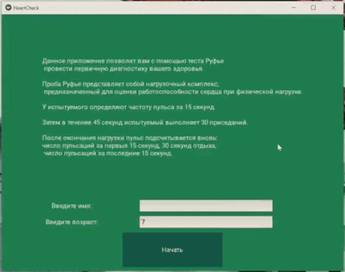

<h1 align="center">Heart check Ruffier</h1>

<p align="left">
 
</p>

<p align="right">
  


<p align="center">
  
  
  
  
  
</p>

  


_Приложение на основе теста Руфье_

---
# Описание теста
Сумма измерений пульса в трех попытках (до нагрузки, сразу после и после короткого отдыха)
в идеале должна быть не более 200 ударов в минуту. 
Мы предлагаем измерять свой пульс на протяжении 15 секунд, 
и приводим результат к ударам в минуту умножением на 4:
    S = 4 * (P1 + P2 + P3)
Чем дальше этот результат от идеальных 200 ударов, тем хуже.
Традиционно таблицы даются для величины, делённой на 10. 

### Индекс Руфье   
    IR = (S - 200) / 10
оценивается по таблице в соответствии с возрастом:
|        7-8          |   9-10         |       11-12      |         13-14         |       15+ (только для подростков!)|
|---------------------|----------------|------------------|-----------------------|----------------------------------|
|отл.    6.4 и менее  |  4.9 и менее   |    3.4 и менее   |      1.9 и менее      |         0.4 и менее|
|хор.    6.5 - 11.9   |  5 - 10.4      |    3.5 - 8.9     |      2 - 7.4          |         0.5 - 5.9|
|удовл.  12 - 16.9    |  10.5 - 15.4   |    9 - 13.9      |      7.5 - 12.4       |         6 - 10.9|
|слабый  17 - 20.9    |  15.5 - 19.4   |    14 - 17.9     |      12.5 - 16.4      |         11 - 14.9|
|неуд.   21 и более   |  19.5 и более  |    18 и более    |      16.5 и более     |        15 и более|

для всех возрастов результат "неуд" отстоит от "слабого" на 4, 
тот от "удовлетворительного" на 5, а "хороший" от "уд" - на 5.5

# Демонстрация

  

# Содержание проекта

| Модуль      | Описание                       |
| ------------| -------------------------------|
| `ruffier`   | Рассчет показателей тестов      |
| `runner`   | Анимация приседаний |
| `seconds`| Таймеры |
| `sits     ` | Вывод кол-ва приседаний на экран |
| `main     ` | Основная логика и точка входа |

## Запуск

Скачайте библиотеку kivy

```bash
  pip install kivy
```
Запустите программу

```bash
  python main.py
```

